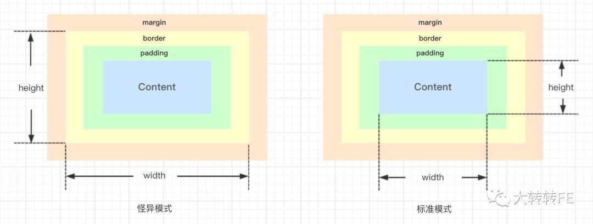
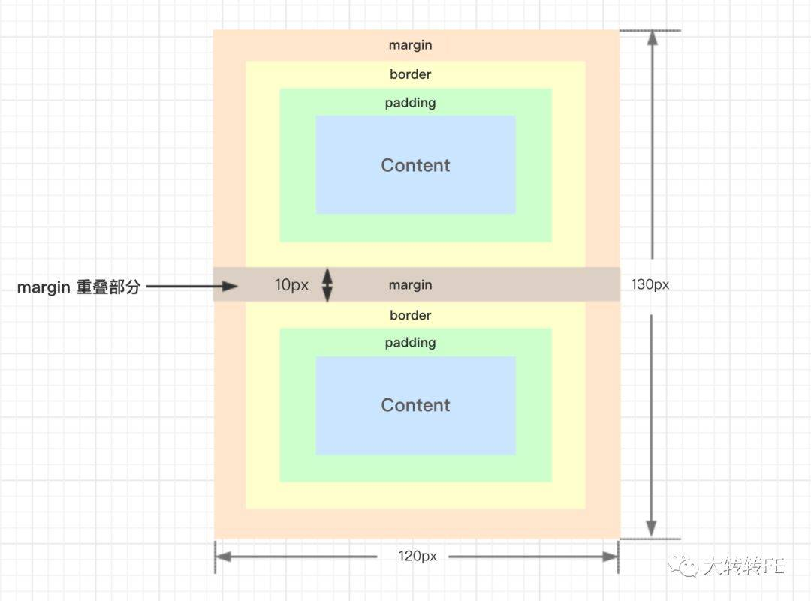
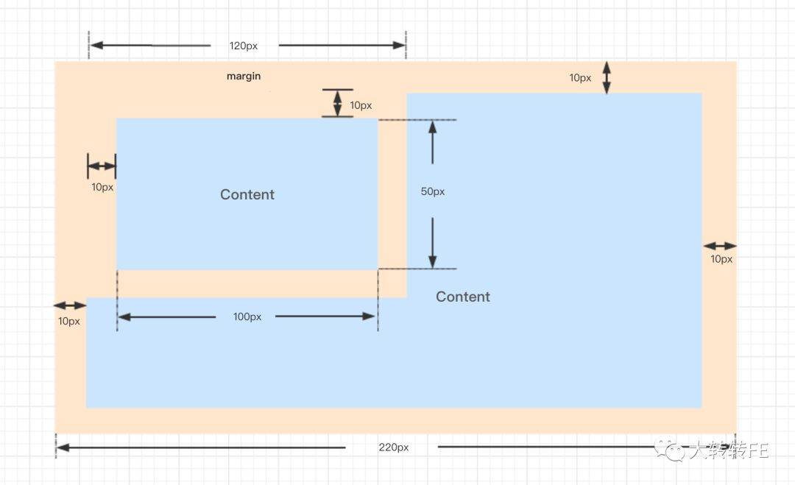
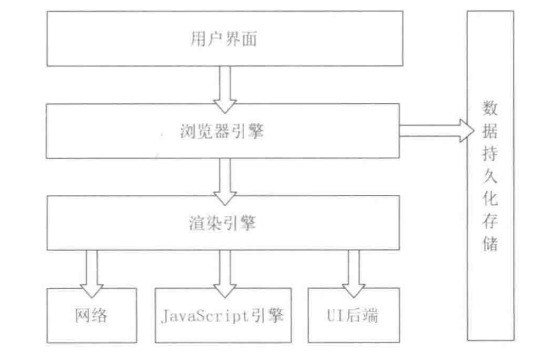
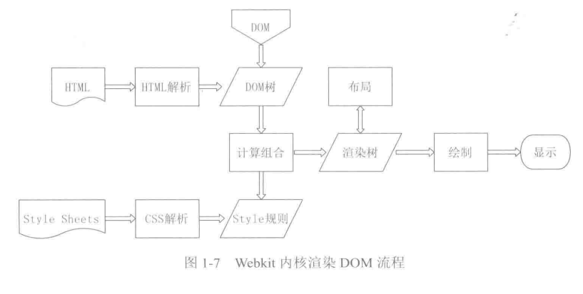
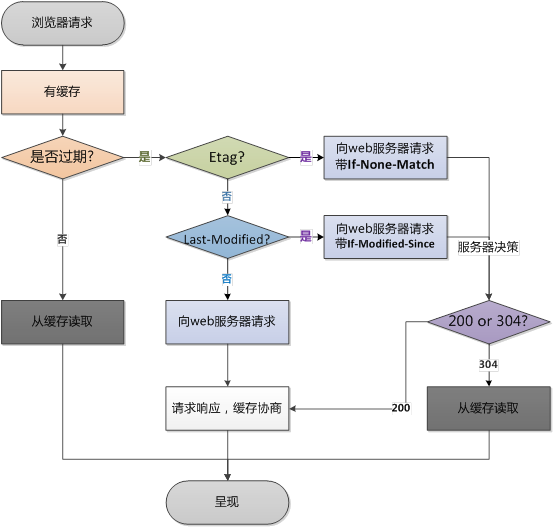
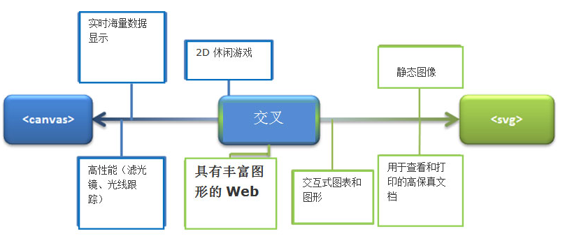

<!-- TOC -->

- [1. 盒模型](#1)
- [2. BFC](#2-bfc)
- [3. 浏览器相关](#3)
- [4. 说说你对语义化的理解](#4)
- [5. 说说H5新增内容](#5-h5)
- [6. 浏览器缓存机制](#6)
- [7. Cookie、 LocalStorage 与 SessionStorage区别](#7-cookie-localstorage--sessionstorage)
- [8. HTML5的离线储存怎么使用，工作原理能不能解释一下？](#8-html5)
- [9. Label的作用是什么？是怎么用的？](#9-label)
- [10. canvas与svg区别？](#10-canvassvg)
  - [10.1 canvas和svg各自使用场景？](#101-canvassvg)
  - [10.2 canvas常用api有哪些？](#102-canvasapi)
  - [10.3 canvas如何转换为图片？](#103-canvas)
  - [10.4 canvas如何绑定事件？](#104-canvas)
- [11. 跨域方法有哪些](#11)
  - [11.1 同源策略是什么？](#111)
  - [11.2 常见六种种跨域方法？](#112)
    - [11.2.1 简单请求和非简单请求](#1121)
    - [11.2.2 如何跨域携带cookie？](#1122-cookie)
- [11. web攻击主要有哪些？](#11-web)

<!-- /TOC -->
# 1. 盒模型
盒子模型主要有两种  
w3c标准盒模型（声明了文档类型则以标准模式解析，H5声明方式是<!DOCTYPE html>，H4则需要设置DTD类型，包括严格和过渡)  
IE下的怪异盒模型（如果doctype缺失，则在ie6、ie7、ie8将会触发怪异模式）

还有用来改变盒模型width范围的一个css3的属性, box-sizing:
设置为'border-box'时, width = border + padding + content;
设置为'content-box'时, width = content。

垂直外边距合并  
1. 相邻元素之间
毗邻的两个元素之间的外边距会折叠（除非后一个元素需要清除之前的浮动）。

2. 父元素与其第一个或最后一个子元素之间
父子组件的折叠触发, 要求不能有间隙, 就是父组件不能设置border或padding值, 不能有空余的内容, 且同时有margin值。
```
 <div class="outer">
   <div class="inner"></div>
 </div>

    .outer {
      width: 200px;
      height: 100px;
      margin: 10px;
      background-color: #dedede;
    }
    .inner{
      width: 100px;
      height: 50px;
      margin: 10px;
      background-color: #bcbcbc;
    }
```

如果有间隙的话是不会触发折叠的, 比如父级元素设置了padding


常见不产生外边距重叠的方法是创建BFC

# 2. BFC
定义：块级格式化上下文，它是单独的一块渲染区域，有着自己的渲染规则，不同的BFC之间互不影响  
触发BFC的情况有以下情况：  
* 根元素或其它包含它的元素
* 浮动元素 (元素的float不是none)
* 绝对定位元素 (元素具有 position 为 absolute 或 fixed)
* 块元素具有overflow ，且值为scroll、hidden，不是visible
* 内联块inline-block(元素具有 display: inline-block)
* 表格单元格 (元素具有 display: table-cell，HTML表格单元格默认属性)
* 表格标题 (元素具有 display: table-caption, HTML表格标题默认属性)
注意，根元素就创建了一个BFC

BFC有以下特性：
* 内部块级盒子垂直方向排列
* 盒子垂直距离由margin决定，同一个BFC的盒子外边距会合并
* BFC就是一个隔离的容器，内部子元素不会影响到外部元素
* 每个元素的margin box的左边， 与包含块border box的左边相接触(对于从左往右的格式化，否则相反)。即使存在浮动也是如此(比如文字环绕效果就是因为该原因)。
* BFC的区域不会与浮动元素叠加，计算BFC的高度时，浮动元素也参与计算。

BFC用途：
* 清除浮动;
* 解决外边距合并;
* 布局;  
参考文章： [CSS中的BFC](https://www.w3cplus.com/css/understanding-block-formatting-contexts-in-css.html)

# 3. 浏览器相关
浏览器内核主要有： 
* IE浏览器内核：Trident内核，也是俗称的IE内核；
* Chrome浏览器内核：统称为Chromium内核或Chrome内核，以前是Webkit内核，现在是Blink内核；
* Firefox浏览器内核：Gecko内核，俗称Firefox内核；
* Safari浏览器内核：Webkit内核；
* Opera浏览器内核：最初是自己的Presto内核，后来是Webkit，现在是Blink内核； 
 
浏览器组成：  

  
如图我们可以知道浏览器引擎和JavaScript引擎不是同一回事，这个也就说明了为什么JavaScript是单线程但是浏览器可以异步发起请求的问题。

各个浏览器渲染引擎之间的差异与渲染引擎是怎样工作的
   
对比之后我们可以发现Gecko内核是需要先解析HTML然后再解析CSS，webkit内核是并行执行的。所以webkit内核在解析CSS这方面会相对高效

# 4. 说说你对语义化的理解
选择合适的标签（代码语义化）像标题（H1~H6）、列表（li）、强调（strong em）等等，便于开发者阅读和写出更优雅的代码的同时让浏览器的爬虫和机器很好地解析。

* 为了在没有CSS的情况下，页面也能呈现出很好地内容结构、代码结构；
* 用户体验：例如title、 alt 用于解释名词或解释图片信息、 label 标签的活用；
* 有利于SEO：和搜索引擎建立良好沟通，有助于爬虫抓取更多的有效信息：爬虫依赖于标签来确定上下文和各个关键字的权重；
* 方便其他设备解析（如屏幕阅读器、盲人阅读器、移动设备）以意义的方式来渲染网页；
* 便于团队开发和维护，语义化更具可读性，是下一步网页的重要动向，遵循W3C标准的团队都遵循这个标准，可以减少差异化。

```
<header></header>
<footer></footer>
<nav></nav>
<section></section>
<article></article>
<aslde></aside> 
<figure></figure> 创建图（默认有40px左右margin）。
<figcaption></figcaption> figure的标题，必须是figure内嵌的第一个或者最后一个元素。
<blockquoto></blockquoto> 引述文本，默认新的一行显示。
<time></time>：标记时间
<address></address> 作者、相关人士或组织的联系信息（电子邮件地址、指向联系信息页的链接）。
<datalist></datalist> 选项列表，与input元素配合使用，来定义input可能的值
<details></details> 用于描述文档或者文档某个部分的细节, 配合 summary 标签一起
```

# 5. 说说H5新增内容
* 语义化更好的内容标签（header,nav,footer,aside,article,section）音频、视频API(audio,video)
* 新增input type类型（如email url number range Date pickers (date, month, week, time, datetime, datetime-local) search color）
* 拖拽释放API，画布CanvasAPI，地理API
* sessionStorage和localStorage本地存储
* webworker、websocket等新技术

# 6. 浏览器缓存机制

1. 浏览器会查询Cache-Control(使用Expires也是可以的，但是Expires一般是绝对时间，Cache-Control设置的是相对时间)来判断内容是否过期，如果未过期则直接读取浏览器文件，不发送HTTP请求，否则进入下一步
2. 在浏览器端判断上次文件返回头里是否含有Etag信息，有则连同If-None-Match字段发送请求，服务器判断Etag未修改则返回304状态码，修改则返回200，否则进入下一步
3. 在浏览器端判断上次文件返回头里是否含有Last-Modified信息，有则连同If-Modified-Since字段发送请求，服务器判断Last-Modified是否失效，失效返回200，未失效返回304

# 7. Cookie、 LocalStorage 与 SessionStorage区别
| 特性 | Cookie| SessionStorage | LocalStorage |
|------| ------ | ------ | ------ |
|数据的生命期 | 一般由服务器生成，可设置失效时间。如果在浏览器端生成Cookie，默认是关闭浏览器后失效 | 仅在当前会话下有效，关闭页面或浏览器后被清除 | 除非被清除，否则永久保存 |
|存放数据大小 |  4K左右 |一般为5MB |
|与服务器端通信 |  每次都会携带在HTTP头中，如果使用cookie保存过多数据会带来性能问题 |不参与和服务器的通信 |
相同点： 都有同源限制
localStorage和sessionStorage具有相同的操作方法，例如key、setItem、getItem和removeItem、clear等
> 注意： 通过点击链接（或者用了 window.open）打开的新标签页之间是属于同一个 session 的，但新开一个标签页总是会初始化一个新的 session，即使网站是一样的，它们也不属于同一个 session。（参考：[Sessionstorage共享注意](https://github.com/lmk123/blog/issues/66)）

# 8. HTML5的离线储存怎么使用，工作原理能不能解释一下？

在用户没有与因特网连接时，可以正常访问站点或应用，在用户与因特网连接时，更新用户机器上的缓存文件

原理：HTML5的离线存储是基于一个新建的.appcache文件的缓存机制(不是存储技术)，通过这个文件上的解析清单离线存储资源，这些资源就会像cookie一样被存储了下来。之后当网络在处于离线状态下时，浏览器会通过被离线存储的数据进行页面展示

如何使用：
页面头部像下面一样加入一个manifest的属性；
```
<!DOCTYPE HTML>
<html manifest="demo.appcache">

<body>
The content of the document......
</body>

</html>
```
在cache.manifest文件的编写离线存储的资源
在离线状态时，操作window.applicationCache进行需求实现
```
CACHE MANIFEST
    #v0.11
    CACHE:
    js/app.js
    css/style.css
    NETWORK:
    resourse/logo.png
    FALLBACK:
    / /offline.html
```
浏览器是怎么对HTML5的离线储存资源进行管理和加载的呢？  
在线的情况下，浏览器发现html头部有manifest属性，它会请求manifest文件，如果是第一次访问app，那么浏览器就会根据manifest文件的内容下载相应的资源并且进行离线存储。如果已经访问过app并且资源已经离线存储了，那么浏览器就会使用离线的资源加载页面，然后浏览器会对比新的manifest文件与旧的manifest文件，如果文件没有发生改变，就不做任何操作，如果文件改变了，那么就会重新下载文件中的资源并进行离线存储。
离线的情况下，浏览器就直接使用离线存储的资源。

# 9. Label的作用是什么？是怎么用的？

label标签来定义表单控制间的关系,当用户选择该标签时，浏览器会自动将焦点转到和标签相关的表单控件
```
<label for="mobile">Number:</label><input type="text" id="mobile"/>
```

# 10. canvas与svg区别？
Canvas与SVG的主要区别
* 从图像类别区分，Canvas是基于像素的位图，而SVG却是基于矢量图形。可以简单的把两者的区别看成photoshop与illustrator的区别。
* 从结构上说，Canvas没有图层的概念，所有的修改整个画布都要重新渲染，而SVG则可以对单独的标签进行修改。
* 从操作对象上说，Canvas是基于HTML canvas标签，通过宿主提供的Javascript API对整个画布进行操作的，而SVG则是基于XML元素的。
* 从功能上讲，SVG发布日期较早，所以功能相对Canvas比较完善。
* 关于动画，Canvas更适合做基于位图的动画，而SVG则适合图表的展示。  
拓展问题：  
## 10.1 canvas和svg各自使用场景？

参考文章： [如何为您的网站在Canvas和SVG之间做出选择](https://msdn.microsoft.com/zh-cn/ie/hh377884)
## 10.2 canvas常用api有哪些？
canvas标签的常用绘制API
初识canvas只有两个属性width，和height
```
<canvas id="id" width="" height=""> 您的浏览器不知此canvas标签 </canvas>
```
2.在canvas里创建content对象 //getContext
```
var cxt=document.getElementById(‘id’).getContext(‘2d’) //目前只支持2d的画布
```
3.画路径前开启一条路径,画后关闭一条路径
```
cxt.beginPath() // 开启路径，开启后可以从新设置相关属性   
cxt.closePath()//关闭一条路径
```
4.画画前相关属性的设置
```
cxt.lineWidth=5;//设置线宽    
cxt.strokeStyle='#FCF';//设置线段的颜色    
cxt.lineCap='round';//设置线的端点, "butt"、"round" 和  "square"    
cxt.fillStyle='#FCF'; //设置填充的颜色 
cxt.font='40px 楷体'; //指明字体 
cxt.shadowColor='gray'; //阴影的颜色 
cxt.shadowBlur=1; //阴影的模糊度 
cxt.shadowOffsetX=-2;//隐形的偏移度  
cxt.shadowOffsetY=6; 
cxt.globalAlpha=0.2; //设置透明度   
cxt.linejoin=’round’;//设置两条线相交时的交点的样式默认是 
bevel 创建斜角。
round 创建圆角。
miter 默认。创建尖角。 
Cxt.miterLimit=5;//设置最大斜角交点的长
```
5.写字相关属性
```
cxt.font='40px 楷体'; //指明字体
```
6.画画的相关方法
```
ctx.drawImage(img, 0, 0, canvas.width, canvas.height);
var c=document.getElementById("myCanvas");  
var ctx=c.getContext("2d"); 
ctx.rect(20,20,150,100);  
Cxt.clearRect();//清空一个区域的矩形范围   
Cxt.scale(x,y)；//放大x水平放大，y垂直放大  
var c=document.getElementById("myCanvas"); 
var ctx=c.getContext("2d"); 
ctx.strokeRect(5,5,25,15);  
ctx.scale(2,2);  
ctx.strokeRect(5,5,25,15)    
cxt.moveTo(20,20);//设置画线起点   
cxt.lineTo(40,400);//划到那里   
cxt.stroke();  //路径弄好后开始画啦！    
cxt.arc(250,250,50,0,Math.PI*2,true);//画圆圆弧的路径，圆心，x,y，半径，角度起点，终点角度，顺逆时针     
cxt.arc(250,250,50,0,Math.PI*2,true);//画圆，圆心，x,y，半径，角度起点，终点角度，顺逆时针   
cxt.fill();//带填充的圆，矩形  cxt.clip();//裁剪，先来一个矩形rect(50,20,200,120);，然后再clip， 最后在里面画图
 
cxt.arcTo(x1,y1,x2,y2,r);//arcTo函数在工作时将会从画笔原来所在点开始绘制一条直线
到弧线的开始点，绘画弧线完成后还会将画笔移动到弧线的终点，从而对画笔位置造
成影响。
```
## 10.3 canvas如何转换为图片？
```
var canvas = document.getElementById("mycanvas");
var img = canvas.toDataURL("image/png");
// data:image/jpeg;base64,/9j/4AAQSkZJRgABAQ...9oADAMBAAIRAxEAPwD/AD/6AP/Z"
location = img;
```
```
function test() {
 var canvas = document.getElementById("canvas");
 canvas.toBlob(function(blob) {
    var newImg = document.createElement("img"),
        url = URL.createObjectURL(blob);
    newImg.onload = function() {
        // no longer need to read the blob so it's revoked
        URL.revokeObjectURL(url);
    };
    newImg.src = url;
    document.body.appendChild(newImg);
 });
}
```
参考： [HTML5 Canvas编程](https://www.kancloud.cn/digest/canvas-programming/154007)

## 10.4 canvas如何绑定事件？
1. 首先要做的，是给Canvas元素绑定事件，比如Canvas内部某个图形要绑定点击事件，就需要通过Canvas元素代理该事件：
```
cvs = document.getElementById('mycanvas');
cvs.addEventListener('click', function(e){
  //...
}, false);
```
接下来需要判断事件对象发生的位置，事件对象e的layerX和layerY属性表示Canvas内部坐标系中的坐标。但是这个属性Opera不支持，Safari也打算移除，所以要做一些兼容写法：
```
function getEventPosition(ev){
  var x, y;
  if (ev.layerX || ev.layerX == 0) {
    x = ev.layerX;
    y = ev.layerY;
  } else if (ev.offsetX || ev.offsetX == 0) { // Opera
    x = ev.offsetX;
    y = ev.offsetY;
  }
  return {x: x, y: y};
}
//注：使用上面这个函数，需要给Canvas元素的position设为absolute。
```
现在有了事件对象的坐标位置，下面就要判断Canvas里的图形，有哪些覆盖了这个坐标。

2. isPointInPath原生api  
参考： 
* [HTML5 Canvas 的事件处理](http://www.xyhtml5.com/html5-canvas-event-handler.html)
* [如何为Canvas中特定图形绑定事件？](https://imys.net/20160808/canvas-event.html)

# 11. 跨域方法有哪些
## 11.1 同源策略是什么？
同源策略限制了从同一个源加载的文档或脚本如何与来自另一个源的资源进行交互。这是一个用于隔离潜在恶意文件的重要安全机制。
如果两个页面的协议，域名和端口（如果有指定）都相同，则两个页面具有相同的源。
跨源网络访问Section
同源策略控制了不同源之间的交互，例如在使用XMLHttpRequest 或  标签时则会受到同源策略的约束。还有
1. cookies、localstorage和IndexDB无法读取
2. DOM无法获得
3. Ajax无法请求

以下是可能嵌入跨源的资源的一些示例：
```
<script src="..."></script> 标签嵌入跨域脚本。语法错误信息只能在同源脚本中捕捉到。  
<link rel="stylesheet" href="..."> 标签嵌入CSS。由于CSS的松散的语法规则，CSS的跨域需要一个设置正确的Content-Type 消息头。不同浏览器有不同的限制： IE, Firefox, Chrome, Safari (跳至CVE-2010-0051)部分 和 Opera。  
嵌入图片。支持的图片格式包括PNG,JPEG,GIF,BMP,SVG,...  
<video> 和 <audio>嵌入多媒体资源。  
<object>, <embed> 和 <applet> 的插件。  
@font-face 引入的字体。一些浏览器允许跨域字体（ cross-origin fonts），一些需要同源字体（same-origin fonts）。  
<frame> 和 <iframe> 载入的任何资源。站点可以使用X-Frame-Options消息头来阻止这种形式的跨域交互。
```
## 11.2 常见六种种跨域方法？
1. jsonp
主要原理为：后台拼接成callback(data)的字符串，返回到前端页面后直接执行
```
function showJsonp(obj){
  console.log(obj.message);
}
var url = 'http://127.0.0.1:8787/?func=showJsonp'
app.get('*', function(req, res) {
  let callback = req.query.func;
  let content = callback+"({'message':'测试数据2'})";
  res.send(content);
});
```
2. CORS跨域资源共享策略
后台设置：
```
Access-Control-Allow-Origin:.$origin;  //允许的域名
Access-Control-Allow-Methods:POST;  //允许的方法
Access-Control-Allow-Headers:x-requested-with,content-type;  //服务器支持的头信息 
```
### 11.2.1 简单请求和非简单请求  
补充： CORS跨域涉及到简单请求和非简单请求  
简单请求  
当请求同时满足下面两个条件时，浏览器会直接发送GET请求，在同一个请求中做跨域权限的验证。  
请求方法是下列之一：  
```
GET  
HEAD  
POST
```  
请求头中的Content-Type请求头的值是下列之一： 
``` 
application/x-www-form-urlencoded
multipart/form-data
text/plain
```
简单请求时，浏览器会直接发送跨域请求，并在请求头中携带Origin 的header，表明这是一个跨域的请求。服务器端接到请求后，会根据自己的跨域规则，通过Access-Control-Allow-Origin和Access-Control-Allow-Methods响应头，来返回验证结果。如果验证成功，则会直接返回访问的资源内容。如果验证失败，则返回403的状态码，不会返回跨域请求的资源内容。可以通过浏览器的Console查看具体的验证失败原因

非简单请求
请求方法不是上述简单请求即为非简单请求
当请求满足下面任意一个条件时，浏览器会先发送一个OPTION请求，用来与目标域名服务器协商决定是否可以发送实际的跨域请求。  
浏览器在发现页面中有上述条件的动态跨域请求的时候，并不会立即执行对应的请求代码，而是会先发送Preflighted requests（预先验证请求），Preflighted requests是一个OPTION请求，用于询问要被跨域访问的服务器，是否允许当前域名下的页面发送跨域的请求。 

### 11.2.2 如何跨域携带cookie？
默认情况下，跨源请求不提供凭据(cookie、HTTP认证及客户端SSL证明等)。通过将withCredentials属性设置为true，可以指定某个请求应该发送凭据。
```
xhr.withCredentials = true;
```
如果服务器接收带凭据的请求，会用下面的HTTP头部来响应。
```
Access-Control-Allow-Credentials: true
```
  参考： [CORS——跨域请求那些事儿](https://yq.aliyun.com/articles/69313)

3. websocket
WebSocket是一种通信协议，使用ws://（非加密）和wss://（加密）作为协议前缀。该协议不实行同源政策，只要服务器支持，就可以通过它进行跨源通信。
```
// 初始化一个 WebSocket 对象
var ws = new WebSocket("ws://localhost:9998/echo");

// 建立 web socket 连接成功触发事件
ws.onopen = function () {
  // 使用 send() 方法发送数据
  ws.send("发送数据");
  alert("数据发送中...");
};

// 接收服务端数据时触发事件
ws.onmessage = function (evt) {
  var received_msg = evt.data;
  alert("数据已接收...");
};

// 断开 web socket 连接成功触发事件
ws.onclose = function () {
  alert("连接已关闭...");
};
```
4. location.hash跨域  
假设域名a.com下的文件cs1.html要和jianshu.com域名下的cs2.html传递信息。  
1、cs1.html首先创建自动创建一个隐藏的iframe，iframe的src指向jianshu.com域名下的cs2.html页面。  
2、cs2.html响应请求后再将通过修改cs1.html的hash值来传递数据。  
3、同时在cs1.html上加一个定时器，隔一段时间来判断location.hash的值有没有变化，一旦有变化则获取获取hash值。  
  
注：由于两个页面不在同一个域下IE、Chrome不允许修改parent.location.hash的值，所以要借助于a.com域名下的一个代理iframe。  

优点：1.可以解决域名完全不同的跨域。2.可以实现双向通讯。  
缺点：location.hash会直接暴露在URL里，并且在一些浏览器里会产生历史记录，数据安全性不高也影响用户体验。另外由于URL大小的限制，支持传递的数据量也不大。有些浏览器不支持onhashchange事件，需要轮询来获知URL的变化。

5. 主域相同使用document.domain跨域
```
(1) 在www.a.com/a.html中：
document.domain = 'a.com';
var ifr = document.createElement('iframe');
ifr.src =  'http://www.script.a.com/b.html';  
ifr.display = none;
document.body.appendChild(ifr);
ifr.onload = function(){ 
    var doc = ifr.contentDocument || ifr.contentWindow.document;                                                          
    ifr.onload = null;
};

(2) 在www.script.a.com/b.html中：
document.domain = 'a.com';//注意：使用document.domain允许子域安全访问其父域时，您需要设置document域在父域和子域中具有相同的值。这是必要的，即使这样做只是将父域设置回其原始值。否则可能会导致权限错误。这里都是a.com。
```
6. window.postMessage跨域

HTML5引入了一个全新的API：跨文档通信 API（Cross-document messaging）。这个API为window对象新增了一个window.postMessage方法，允许跨窗口通信，不论这两个窗口是否同源。
```
var popup = window.open('http://bbb.com', 'title');//父窗口http://aaa.com向子窗口http://bbb.com发消息，调用postMessage方法。
popup.postMessage('Hello World!', 'http://bbb.com');
```
postMessage方法的第一个参数是具体的信息内容，第二个参数是接收消息的窗口的源（origin），即"协议 + 域名 + 端口"。也可以设为*，表示不限制域名，向所有窗口发送。  

父窗口和子窗口都可以通过message事件，监听对方的消息。message事件的事件对象event，提供以下三个属性：  

1、event.source：发送消息的窗口。  
2、event.origin： 消息发向的网址。  
3、event.data：消息内容。  
一个例子：
```
 var onmessage = function (event) {  
   var data = event.data;//消息  
   var origin = event.origin;//消息来源地址  
   var source = event.source;//源Window对象  
   if(origin == "http://www.aaa.com"){  
    console.log(data);//hello world!  
   }  
    source.postMessage('Nice to see you!', '*');
 };  
 if (typeof window.addEventListener != 'undefined') {  
   window.addEventListener('message', onmessage, false);  
 } else if (typeof window.attachEvent != 'undefined') {  
   //ie  
   window.attachEvent('onmessage', onmessage);  
 }
```

# 11. web攻击主要有哪些？
1. XSS跨站脚本攻击攻击
   预防：对字符进行转义和过滤
   ```
   html.replace(/&/g,'&amp;');
   html.replace(/</g,'&lt;');
   html.replace(/>/g,'&gt;');
   html.replace(/ /g,'&nbsp;');
   html.replace(/\n/g,'<br>');
   ```
2. SQL注入
3. CSRF跨站请求伪造攻击
   预防：
   1. 加密计算的Token验证
   2. 验证码
   3. 设置cookie为http-only即不能被JS读取
4. 请求劫持（DNS和HTTP劫持）
5. DDos攻击
  
   参考： [常见 Web 安全攻防总结](https://zoumiaojiang.com/article/common-web-security/#xss)
