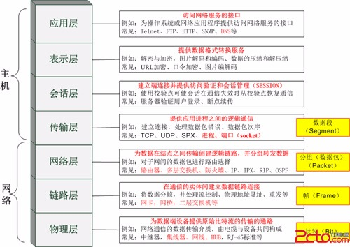
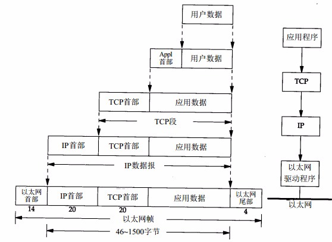
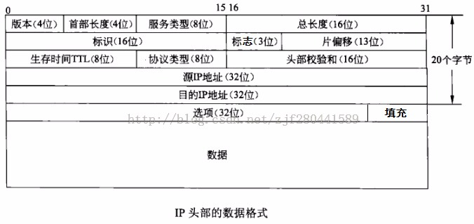
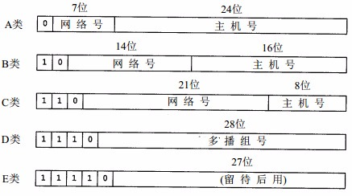
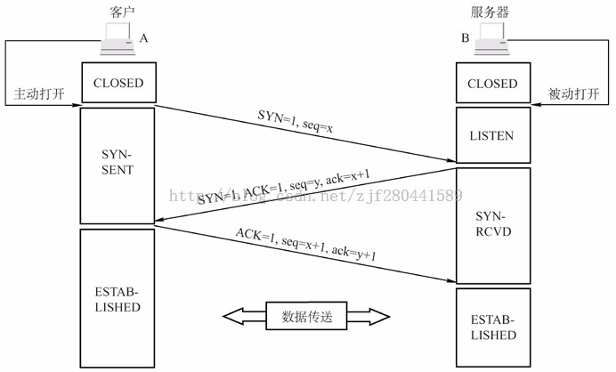
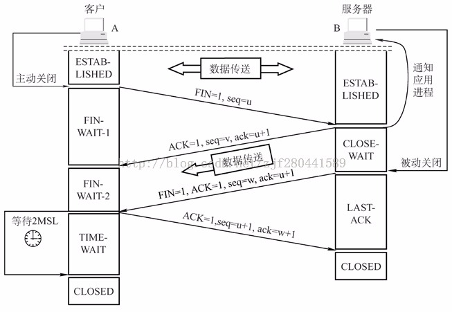
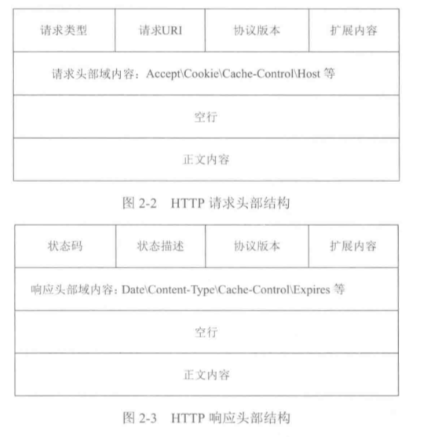
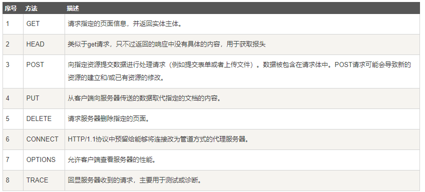
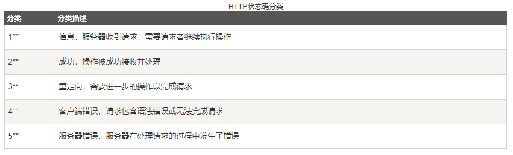

<!-- TOC -->

- [一、计算机网络](#)
  - [1. 概述](#1)
    - [1.1 TCP/IP分层](#11-tcp-ip)
    - [1.2 电路交换、报文交换与分组交换](#12)
    - [1.3 封装](#13)
    - [1.4 端口号](#14)
  - [2. 链路层](#2)
  - [3. 网络层](#3)
    - [3.1 IP协议](#31-ip)
      - [3.1.1 IP地址分类](#311-ip)
  - [3.2 ARP协议](#32-arp)
  - [3.3 RARP协议](#33-rarp)
  - [3.4 ICMP协议](#34-icmp)
    - [3.4.1 ICMP特征](#341-icmp)
    - [3.4.2 Ping实现原理](#342-ping)
    - [3.4.3 TraceRoute原理](#343-traceroute)
  - [4. 传输层](#4)
    - [4.1 TCP三次握手](#41-tcp)
    - [4.2 TCP四次挥手](#42-tcp)
    - [4.3 TCP vs UDP](#43-tcp-vs-udp)
- [二、HTTP协议](#http)
  - [1. 报文格式](#1)
    - [1.1 请求行](#11)
    - [1.2 请求头部](#12)
    - [1.3 空行](#13)
    - [1.4 请求数据](#14)
    - [1.5 GET vs POST](#15-get-vs-post)
  - [2. HTTP状态码](#2-http)
  - [3. 常见请求字段](#3)
  - [4. HTTP长连接和短连接](#4-http)
  - [5. HTTP2.0的优点](#5-http20)
  - [6. HTTPS协议](#6-https)

<!-- /TOC -->
# 一、计算机网络
## 1. 概述
### 1.1 TCP/IP分层
TCP/IP是一个协议族，是一组不同层次上的多个协议的组合，通常可分为4层协议系统，每组负责不同的功能
* 链路层：也称数据链路层或网络接口层，用于处理与电缆（或其他任何传输媒介）的物理接口细节； 
数据链路层中的主要协议有点对点协议PPP,CSMA/CD协议,以太网802.3

* 网络层：网络层向上只提供简单灵活的、无连接的、尽最大努力交付的数据报服务。网络层不提供服务质量的承诺,即所传输的分组可能出错、丢失、重复和失序,当然也不保证分组交付的时限。

  网际层中主要协议有IP协议,地址解析协议ARP和网际控制报文协议ICMP等。 
IP协议是网际层的核心,通过路由选择将下一跳IP封装后交给网络接口层。IP 数据报是无连接服务。 
ICMP是网际层的补充,可以回送报文。用来检测网络是否通畅(使用ping命令)。 
ARP是通过已知IP,寻找对于主机的MAC地址。

* 传输层：主要为两台主机身上的应用程序提供端到端的通信；TCP（传输控制协议）和UDP（用户数据包协议）  
  两者的区别如下：  
  1. TCP提供面向连接的、可靠的数据流传输，而UDP提供的是非面向连接的、不可靠的数据流传输 
  2. TCP传输单位称为TCP报文段，UDP传输单位称为用户数据报。   
  3. TCP注重数据安全性，UDP数据传输快，因为不需要连接等待，少了许多操作，但是其安全性却一般。

* 应用层：负责处理特定的应用程序细节；   
    应用层中主要协议有域名系统DNS,文件传输协议FTP,远程终端协议TELNET,超文本传输协议HTTP,简单邮件传送协议SMTP,邮件读取协议POP3和IMAP,动态主机配置协议DHCP等。   
    DNS：提供域名解析服务,提供域名到IP地址之间的转换,使用端口53   
    FTP：在异构网络中任意计算机之间传送文件,使用端口21   
    TELNET：提供用户远程登录服务,使用端口23,使用明码传送,保密性差、简单方便   
    HTTP：用于实现万维网上的各种链接,即万维网客户程序与万维网服务器之间的连接,使用端口80   
    SMTP/POP3、IMAP：提供邮件的传输,用来控制信件的发送、中转、从邮件服务器读取邮件   
    DHCP：为新加入网络的计算机自动分配IP地址

OSI参考模型分层：  

模型把网络通信的工作分为7层。1至4层被认为是低层，这些层与数据移动密切相关。5至7层是高层，包含应用程序级的数据。每一层负责一项具体的工作，然后把数据传送到下一层。由低到高具体分为：物理层、数据链路层、网络层、传输层、会话层、表示层和应用层。

每一层的功能和协议有：

* 物理层：通过媒介传输比特,确定机械及电气规范（比特Bit）；RJ45、CLOCK、IEEE802.3 （中继器，集线器，网关）
* 数据链路层：将比特组装成帧和点到点的传递（帧Frame）；PPP、FR、HDLC、VLAN、MAC （网桥，交换机）
* 网络层：负责数据包从源到宿的传递和网际互连（包Packet）；IP、ICMP、ARP、RARP、OSPF、IPX、RIP、IGRP、 （路由器）
* 传输层：提供端到端的可靠报文传递和错误恢复（段Segment）；TCP、UDP、SPX
* 会话层：建立、管理和终止会话（会话协议数据单元SPDU）；NFS、SQL、NETBIOS、RPC
* 表示层：对数据进行翻译、加密和压缩（表示协议数据单元PPDU）；JPEG、MPEG、ASII
* 应用层：允许访问OSI环境的手段（应用协议数据单元APDU）；FTP、DNS、Telnet、SMTP、HTTP、WWW、NFS 
 
### 1.2 电路交换、报文交换与分组交换
(1) 电路交换的三个过程   
电路建立 -> 数据传输 -> 电路拆除   
在通信之前要在通信双方之间建立一条被双方独占的物理通路(由通信双方之间的交换设备和链路逐段连接而成)   
(2) 报文交换   
报文交换方式的数据传输单位是报文,报文就是站点一次性要发送的数据块,其长度不限且可变。当一个站要发送报文时,它将一个目的地址附加到报文上,网络节点根据报文上的目的地址信息,把报文发送到下一个节点,一直逐个节点地转送到目的节点。   
每个节点在收到整个报文并检查无误后,就暂存这个报文, 然后利用路由信息找出下一个节点的地址, 再把整个报文传送给下一个节点。因此,端与端之间无需先通过呼叫建立连接。   
(3) 分组交换   
分组交换是报文交换的一种改进,它将报文分成若干个分组,每个分组的长度有一个上限,有限长度的分组使得每个节点所需的存储能力降低了,分组可以存储到内存中,提高了交换速度。它适用于交互式通信,如终端与主机通信。

### 1.3 封装
当应用程序用TCP传送数据时，数据被送入协议栈中，然后逐个通过每一层直到被当作一串比特流送入网络。其中每一层对收到的数据都要增加一些首部信息（有时还要增加尾部信息），该过程下图所示。TCP传给IP的数据单元称作 TCP报文段或简称为TCP段。IP传给网络接口层的数据单元称作 IP数据报(IP datagram)。通过以太网传输的比特流称作帧(Frame)。

### 1.4 端口号
TCP对应的协议：   
（1） FTP：定义了文件传输协议，使用21端口。   
（2） Telnet：一种用于远程登陆的端口，使用23端口，用户可以以自己的身份远程连接到计算机上，可提供基于DOS模式下的通信服务。   
（3） SMTP：邮件传送协议，用于发送邮件。服务器开放的是25号端口。   
（4） POP3：它是和SMTP对应，POP3用于接收邮件。POP3协议所用的是110端口。   
（5）HTTP：是从Web服务器传输超文本到本地浏览器的传送协议。  
UDP对应的协议：   
（1） DNS：用于域名解析服务，将域名地址转换为IP地址。DNS用的是53号端口。   
（2） SNMP：简单网络管理协议，使用161号端口，是用来管理网络设备的。由于网络设备很多，无连接的服务就体现出其优势。   
（3） TFTP(Trival File Transfer Protocal)，简单文件传输协议，该协议在熟知端口69上使用UDP服务。  
## 2. 链路层
在 TCP/IP协议族中，链路层主要有三个目的:  

IP模块发送和接收IP数据报；  
为ARP模块发送ARP请求和接收ARP应答；  
为RARP发送RARP请求和接收RARP应答。TCP/IP支持多种不同的链路层协议，这取决于网络所使用的硬件。  
2.1 基本概念  
以太网和802.3对数据帧的长度都有一个限制，其最大值分别是1500和1492字节。链路层的这个特性称作MTU，最大传输单元。不同类型的网络大多数都有一个上限。  
当在同一个网络上的两台主机互相进行通信时，该网络的MTU是非常重要的。但是如果两台主机之间的通信要通过多个网络，那么每个网络的链路层就可能有不同的MTU。重要的不是两台主机所在网络的MTU的值，重要的是两台通信主机路径中的最小MTU。它被称作路径MTU。  
两台主机之间的路径 MTU不一定是个常数。它取决于当时所选择的路由。而选路不一定是对称的（从A到B的路由可能与从B到A的路由不同），因此路径MTU在两个方向上不一定是一致的。

## 3. 网络层
### 3.1 IP协议
IP是TCP/IP协议族中最为核心的协议，所有的TCP、UDP、ICMP及IGMP数据都以IP数据报格式传输。IP提供不可靠、无连接的数据报传输服务。不可靠是指它不能保证IP数据报能成功地到达目的地，仅提供最好的传输服务。无连接是IP并不维护任何关于后续数据报的状态信息。

#### 3.1.1 IP地址分类
互联网上的每个接口必须有一个唯一的Internet地址（也称作IP地址）。IP地址长 32 bit。Internet地址并不采用平面形式的地址空间，如 1、 2、 3等。IP地址具有一定的结构，五类不同的互联网地址格式如图所示

A类地址：以0开头， 第一个字节范围：0~127（1.0.0.0 - 126.255.255.255；   
B类地址：以10开头， 第一个字节范围：128~191（128.0.0.0 - 191.255.255.255；   
C类地址：以110开头， 第一个字节范围：192~223（192.0.0.0 - 223.255.255.255；   
10.0.0.0—10.255.255.255， 172.16.0.0—172.31.255.255， 192.168.0.0—192.168.255.255。（Internet上保留地址用于内部）
  
IP地址与子网掩码相与得到主机号  
回环地址：   
主要作用有两个：一是测试本机的网络配置，能PING通127.0.0.1说明本机的网卡和IP协议安装都没有问题；另一个作用是某些SERVER/CLIENT的应用程序在运行时需调用服务器上的资源，一般要指定SERVER的IP地址，但当该程序要在同一台机器上运行而没有别的SERVER时就可以把SERVER的资源装在本机，SERVER的IP地址设为127.0.0.1同样也可以运行。 
本地回环地址指的是以127开头的地址（127.0.0.1 - 127.255.255.254），通常用127.0.0.1来表示。

## 3.2 ARP协议
ARP协议的用途：解决同一个局域网内主机或路由器的IP地址和MAC地址的映射问题。  
现在源端计算机 A ( 192.168.3.1 )要和计算机 B(192.168.3.2)通信。在计算机 A 发送信息前, 必须首先得到计算机B的MAC地址的映射关系。

ARP 协议工作过程如下: 

1. 主机 A 首先查看自己的高速缓存中的 ARP缓存表,看其中是否有与 192.168.3.2 对应的 ARP 表项。如果找到,则直接利用该 ARP 表项中的 MAC 值把 IP 数据包封装成帧发送给主机B。
2. 如果在 ARP 表中找不到对应的地址项,则创建一个 ARP 请求数据包,并以广播方式发送(把以太帧的目的地址设置为 FF-FF-FF-FF-FF-FF) 。包中有需要查询的目的计算机的 IP 地址(192.168.3.2) , 以及主机 A 自己的 IP 地址和 MAC 地址。
3. 包括计算机 B 在内的属于 192.168.3.0 网络上的所有计算机都收到 A 的 ARP 请求包,然后将计算机 A 的 IP 地址与 MAC 地址的映射关系存入各自的 ARP 表中。
4. 计算机 B 创建一个 ARP 响应包,在包中填入自己的 MAC 地址,以单播方式直接发送给主机 A。
5. 主机 A 收到响应后, 从包中提取出所需查询的IP地址及其对应的MAC地址, 添加到自己的 ARP 表中。并根据该 MAC 地址将所需要发送的数据包封装成帧发送出去。  
注意:   
(1)ARP 表的内容是定期更新的,如果一条 ARP 表项很久没有使用了,则它将被从 ARP 表中删除。   
(2)如果所要找的主机和源主机不在同一个局域网上, 那么就要通过ARP找到一个位于本局域网上的某个路由器的硬件地址, 然后把分组发送给这个路由器, 让这个路由器把分组转发给下一个网络, 剩下的工作就由下一个网络来做.

## 3.3 RARP协议
反向地址转换协议就是将局域网中某个主机的物理地址转换为IP地址，比如局域网中有一台主机只知道物理地址而不知道IP地址，那么可以通过RARP协议发出征求自身IP地址的广播请求，然后由RARP服务器负责回答。

工作原理：
1. 给主机发送一个本地的RARP广播，在此广播包中，声明自己的MAC地址并且请求任何收到此请求的RARP服务器分配一个IP地址；
2. 本地网段上的RARP服务器收到此请求后，检查其RARP列表，查找该MAC地址对应的IP地址；
3. 如果存在，RARP服务器就给源主机发送一个响应数据包并将此IP地址提供给对方主机使用；
4. 如果不存在，RARP服务器对此不做任何的响应；
5. 源主机收到从RARP服务器的响应信息，就利用得到的IP地址进行通讯；如果一直没有收到RARP服务器的响应信息，表示初始化失败。
## 3.4 ICMP协议
IP提供的是尽最大努力交付的无连接服务,因此并不能解决网络层中的数据报丢失、重复、延迟或乱序等问题,为了提高IP数据报成功交付的机会, 在网络层使用ICMP(Internet Control Message Protocol：Internet控制报文协议)协议来允许主机或者路由器报告差错和异常情况.
### 3.4.1 ICMP特征
a. ICMP就像一个更高层的协议那样使用IP协议(ICMP消息被封装在IP数据报中);然而,ICMP是IP的一个组成部分,并且所有IP模块都必须实现它。   
b. ICMP用来报告错误,是一个差错报告机制。它为遇到差错的路由器提供了向最初源站报告差错的办法,源站必须把差错交给一个应用程序或采取其它措施来纠正问题。   
c. ICMP报文的种类有两种: ICMP差错报告报文和ICMP询问报文;

### 3.4.2 Ping实现原理
Ping(Packet Internet Groper)分组网间探测是ICMP的一个重要应用,用来测试两个主机之间的连通性。Ping使用了ICMP回送请求与回答报文。Ping是应用层直接使用网络层ICMP的一个例子。它没有通过运输层的TCP或UDP。   
实现原理为: ping向目的主机发送4个32字节长的ICMP回送请求报文,若目的主机正常工作并且响应了该ICMP回送请求报文,就将发回ICMP回送回答报文。最后可得出的统计结果为目的IP地址,发送的,收到的和丢失的分组数,及往返时间的最小值、最大值和平均值。

### 3.4.3 TraceRoute原理
Traceroute(Linux)/tracert(Windows)是用来侦测主机到目的主机之间所经路由情况的重要工具。   
它的原理如下：   
源主机首先给目的主机发送一个TTL=1的UDP数据包,而经过的第一个路由器收到这个数据包以后,就自动把TTL减1,而TTL变为0以后,路由器就把这个包给丢弃了,并同时产生”目的主机不可达”的ICMP差错报告报文给源主机。源主机收到这个数据报以后再发一个TTL=2的UDP数据报给目的主机,然后刺激第二个路由器给源主机发送差错报文。如此往复直到到达目的主机。这样,traceroute就拿到了所有的路由器IP。

## 4. 传输层
传输层的主要功能：

1. 传输层为应用进程之间提供端到端的逻辑通信(网络层是为主机到主机提供逻辑通信)。
2. 复用和分用: 复用是指发送方不同的应用进程都可以使用同一个传输层协议传送数据; 分用是指接收方的传输层在剥去报文的首部之后能够把这些数据正确交付到目的应用进程.
3. 传输层还会对收到的报文进行差错检测(首部和数据部分), 而网络层只检查IP数据报的首部, 不检验数据部分是否出错。
4. 传输层需要有两种不同的运输协议:面向连接的传输控制协议 TCP (Transmission Control Protocol)和无连接的用户数据报协议 UDP (User Datagram Protocol);  
流量控制与拥塞控制的区别：  
流量控制往往是指在发送端和接收端之间的点对点通信量的控制. 流量控制所要做的是抑制发送端发送数据的速率, 以便使接收端来得及接收;  
拥塞控制必须确保通信子网能够传送待传送的数据, 是一个全局性的问题, 涉及网络中所有的主机、路由器以及导致网络传输能力下降的所有因素.  
端口：   
端口就是传输层的服务访问点, 用一个16位的数字进行标标记。   
端口号只具有本地意义,即端口号只是为了标志本计算机应用层中的各进程。在因特网中不同计算机的相同端口号是没有联系的。端口的作用是让应用层的各种应用进程都能将其数据通过端口向下交付给传输层,以及让传输层知道应当将其报文段中的数据向上通过端口交付给应用层的哪个进程。   
从这个意义上讲,端口是用来标志应用层的进程;

### 4.1 TCP三次握手
    

1. 第一次握手:客户机的TCP首先向服务器的TCP发送一个连接请求报文段。这个特殊的报文段中不含应用层数据,其首部中的SYN标志位被置为1。另外,客户机会随机选择一个起始序号seq=x(连接请求报文不携带数据,但要消耗掉一个序号)。
2. 第二次握手:服务器的TCP收到连接请求报文段后,如同意建立连接,就向客户机发回确认,并在OS内核中为该TCP连接分配TCP缓存和变量。在确认报文段中,SYN和ACK位都被置为1,确认号字段的值为x+1(表示希望收到的下一个字节的序号为x+1),并且服务器随机产生起始序号seq=y(确认报文不携带数据,但也要消耗掉一个序号)。
3. 第三次握手:当客户机收到确认报文段后,还要向服务器给出确认,并且也要在client端的OS内核中给该连接分配缓存和变量。这个报文段的ACK标志位被置1,序号字段为x+1,确认号字段为y+1。 
需要注意的是:服务器端的资源是在完成第二次握手时分配的,而客户端的资源是在完成第三次握手时分配的。这就使得服务器易于受到SYN洪泛攻击。  
为什么需要采用三次握手?   
主要是为了防止两次握手情况下已失效的连接请求报文段突然又传送到服务端,而产生的错误。   
举例如下:   
客户A向服务器B发出TCP连接请求,第一个连接请求报文在网络的某个节点长时间滞留,A超时后认为报文丢失,于是再重传一次连接请求,B收到后建立连接。数据传输完毕后双方断开连接。而此时,前一个滞留在网络中的连接请求到达了服务端B,而B认为A又发来连接请求,若采用的是“两次握手”,则这种情况下B认为传输连接已经建立,并一直等待A传输数据,而A此时并无连接请求,因此不予理睬,这样就造成了B的资源白白浪费了;但此时若是使用“三次握手”,则B向A返回确认报文段,由于是一个失效的请求,因此A不予理睬,建立连接失败。第三次握手的作用:防止已失效的连接请求报文段突然又传送到了服务器。

### 4.2 TCP四次挥手
  

1. 第一次断开:客户机打算关闭连接,就向其TCP发送一个连接释放报文段,并停止发送数据,主动关闭TCP连接,该报文段的FIN标志位被置1,seq=u,它等于前面已传送过的数据的最后一个字节的序号加1(FIN报文段即使不携带数据,也要消耗掉一个序号)。
2. 第二次断开:服务器收到连接释放报文段后即发出确认,确认号是ack=u+1,而这个报文段自己的序号是v,等于它前面已传送过的数据的最后一个字节的序号加1。 此时,从客户机到服务器这个方向的连接就释放了,TCP连接处于半关闭状态。但服务器若发送数据,客户机仍要接收,即从服务器到客户机这个方向的连接并未关闭。
3. 第三次断开:若服务器已经没有要向客户机发送的数据,就通知TCP释放连接,此时其发出FIN=1的连接释放报文段,序号为w(注意: 此时确认号字段值仍为u+1, 因为这段时间里, 客户端并未发送任何数据到服务器)。
4. 第四次断开:客户机收到连接释放报文段后,必须发出确认。在确认报文段中,ACK字段被置为1,确认号ack=w+1,序号seq=u+1。此时TCP连接还没有释放掉,必须经过时间等待计时器设置的时间2MSL后,A才进入到连接关闭状态。
     
TIME_WAIT状态：  
1. 为了保证客户端发送的最后一个ACK报文段能够达到服务器。 这个ACK报文段可能丢失,因而使处在LAST_ACK状态的服务器收不到确认。这样的话, 服务器会超时重传FIN+ACK报文段,客户端就能在2MSL时间内收到这个重传的FIN+ACK报文段,接着客户端重传一次确认,重启计时器。最后,客户端和服务器都正常进入到CLOSED状态。 
如果客户端在TIME_WAIT状态不等待一段时间,而是在发送完ACK报文后立即释放连接,那么就无法收到服务器重传的FIN+ACK报文段,因而也不会再发送一次确认报文。这样,服务器就无法按照正常步骤进入CLOSED状态。
2. 防止已失效的连接请求报文段出现在本连接中。客户端在发送完最后一个ACK确认报文段后,再经过时间2MSL,就可以使本连接持续的时间内所产生的所有报文段都从网络中消失。这样就可以使下一个新的连接中不会出现这种旧的连接请求报文段。(IP数据报在因特网中的最大生存时间为MSL)
注意:服务器结束TCP连接的时间要比客户端早一些,因为客户机(最先提出close请求的一端)最后要等待2MSL后才可以进入CLOSED状态。

### 4.3 TCP vs UDP  
TCP：
* TCP是一种面向连接的(一对一),提供可靠交付的和全双工通信的,基于字节流的端到端传输层通信协议。
* 面向连接: TCP在传输数据之前必须先建立连接,数据传输结束后要释放连接。
* 一对一: 每一条TCP连接只能有2个端点,故TCP不提供广播或多播服务。
* 可靠交付: TCP提供可靠交付,通过TCP连接传输的数据,无差错、不丢失、不重复、并且按序到达。
* 基于字节流: TCP是面向字节流的。虽然应用进程和TCP的交互是一次一个数据块(大小不等),但TCP把应用程序交下来的数据仅仅看成是一连串的无结构的字节流, 而并不知道所传输的字节流的含义。

UDP：
* UDP是一种无连接的,尽最大努力交付的和全双工通信的,基于报文段的端到端传输层通信协议。
* 无连接: UDP在发送数据之前不需要建立连接
* 尽最大努力交付: UDP不保证可靠交付,主机不需要维持复杂的连接状态
* 面向报文: UDP是面向报文的。UDP对应用层交下来的报文,既不合并,也不拆分,而是保留这些报文的的边界,即应用层交给UDP多长的报文,UDP就照样发送,即一次发送一个报文。在接收端,UDP一次交付一个完整的报文, 因此应用程序需要选择合适的报文大小。   
  其他:   
UDP没有拥塞控制,网络出现的拥塞不会使源主机的发送速率降低。   
UDP支持一对一、一对多、多对一和多对多的交互通信。   
UDP的首部开销小,只有8个字节,比TCP的20个字节的首部要短。

# 二、HTTP协议
HTTP 协议是无状态的(stateless),即不需要记忆交互的当前状态,因为过程简单。   
HTTP 1.0协议是非持续连接。建立TCP连接后,一个HTTP请求过去,一个HTTP响应过来,然后就断开TCP连接。不同于HTTP/1.0,HTTP/1.1 协议使用持续连接。   
HTTP 使用了面向连接的 TCP 向上提供的服务。  

## 1. 报文格式
  
### 1.1 请求行  
请求行由请求方法字段、URL字段和HTTP协议版本字段3个字段组成，它们用空格分隔。例如，GET /index.html HTTP/1.1。  
根据HTTP标准，HTTP请求可以使用多种请求方法。  
HTTP1.0定义了三种请求方法： GET, POST 和 HEAD方法。  
HTTP1.1新增了五种请求方法：OPTIONS, PUT, DELETE, TRACE 和 CONNECT 方法。  

### 1.2 请求头部  
请求头部由关键字/值对组成，每行一对，关键字和值用英文冒号“:”分隔。请求头部通知服务器有关于客户端请求的信息，典型的请求头有：  
User-Agent：产生请求的浏览器类型。  
Accept：客户端可识别的内容类型列表。  
Host：请求的主机名，允许多个域名同处一个IP地址，即虚拟主机。  

### 1.3 空行  
最后一个请求头之后是一个空行，发送回车符和换行符，通知服务器以下不再有请求头。  

### 1.4 请求数据  
请求数据不在GET方法中使用，而是在POST方法中使用。POST方法适用于需要客户填写表单的场合。与请求数据相关的最常使用的请求头是Content-Type和Content-Length。  

### 1.5 GET vs POST
* 请求数据方式不同  GET提交：例如：login.action?name=hyddd&password=idontknow&verify=%E4%BD%A0 %E5%A5%BD。如果数据是英文字母/数字，原样发送，如果是空格，转换为+，如果是中文/其他字符，则直接把字符串用BASE64加密，得出如： %E4%BD%A0%E5%A5%BD，其中％XX中的XX为该符号以16进制表示的ASCII。POST提交：把提交的数据放置在是HTTP包的包体＜request-body＞中。因此，GET提交的数据会在地址栏中显示出来，而POST提交，地址栏不会改变
* GET后退按钮/刷新无害，POST数据会被重新提交（浏览器应该告知用户数据会被重新提交）。
* GET书签可收藏，POST为书签不可收藏。
* GET能被缓存，POST不能缓存。
* GET编码类型application/x-www-form-url，POST编码类型encodedapplication/x-www-form-urlencoded 或 multipart/form-data。为二进制数据使用多重编码。
* GET历史参数保留在浏览器历史中。POST参数不会保存在浏览器历史中。
* GET对数据长度有限制，当发送数据时，GET 方法向 URL 添加数据；URL 的长度是受限制的（URL 的最大长度是 2048 个字符）。POST无限制。
* GET只允许 ASCII 字符。POST没有限制。也允许二进制数据。
* 与 POST 相比，GET 的安全性较差，因为所发送的数据是 URL 的一部分。在发送密码或其他敏感信息时绝不要使用 GET ！POST 比 GET 更安全，因为参数不会被保存在浏览器历史或 web 服务器日志中。
* GET的数据在 URL 中对所有人都是可见的。POST的数据不会显示在 URL 中。

## 2. HTTP状态码

|   状态码   |英文名称|中文描述|
|------|------|------|
|100|Continue|继续。客户端应继续其请求|
|101|Switching Protocols|切换协议。服务器根据客户端的请求切换协议。只能切换到更高级的协议，例如，切换到HTTP的新版本协议|
|200|OK|请求成功。一般用于GET与POST请求|
|204|No Content|无内容。服务器成功处理，但未返回内容。在未更新网页的情况下，可确保浏览器继续显示当前文档|
|206|Partial Content|部分内容。服务器成功处理了部分GET请求|
|301|Moved Permanently|永久移动。请求的资源已被永久的移动到新URI，返回信息会包括新的URI，浏览器会自动定向到新URI。今后任何新的请求都应使用新的URI代替|
|302|Found|临时移动。与301类似。但资源只是临时被移动。客户端应继续使用原有URI|
|304|Not Modified|未修改。所请求的资源未修改，服务器返回此状态码时，不会返回任何资源。客户端通常会缓存访问过的资源，通过提供一个头信息指出客户端希望只返回在指定日期之后修改的资源|
|400|Bad Request|客户端请求的语法错误，服务器无法理解|
|401|Unauthorized|请求要求用户的身份认证|
|403|Forbidden|服务器理解请求客户端的请求，但是拒绝执行此请求|
|404|Not Found|服务器无法根据客户端的请求找到资源（网页）。通过此代码，网站设计人员可设置"您所请求的资源无法找到"的个性页面|
|500|	Internal Server Error	|服务器内部错误，无法完成请求|
|502|	Bad Gateway	|充当网关或代理的服务器，从远端服务器接收到了一个无效的请求|
|503|	Service Unavailable	|由于超载或系统维护，服务器暂时的无法处理客户端的请求。延时的长度可包含在服务器的Retry-After头信息中|
|504|	Gateway Time-out	|充当网关或代理的服务器，未及时从远端服务器获取请求|
|505|	HTTP Version not supported|	服务器不支持请求的HTTP协议的版本，无法完成处理|

## 3. 常见请求字段
|首部字段名|	说明|
|------|------|
|Cache-Control|	控制缓存的行为|
|Connection	|逐跳首部、连接的管理|
|Date	|创建报文的日期时间|
|Pragma	|报文指令|
|Transfer-Encoding	|指定报文主体的传输编码方式|
|Accept	|代表发送端（客户端）希望接受的数据类型,如application/json、text/plain、text/html、image/jpeg、application/msword、image/png、application/pdf|
|Accept-Charset	|优先的字符集|
|Accept-Encoding|	优先的内容编码|
|Accept-Language|	优先的语言|
|Host	|指定资源所在服务器|
|If-Match|	比较实体标记（ETag）|
|If-Modified-Since|	比较资源的更新时间|
|If-None-Match	|比较实体标记（与If-Match相反）|
|Referer	|对请求中URI的原始获取方|
|User-Agent	|Http客户端程序的信息|
|Accept-Range	|是否接受字节范围请求|
|ETag|	资源的匹配信息|
|Location|	另客户端重定向至指定URI|
|Server	|Http服务器的安装信息|
|Vary	|代理服务器缓存的管理信息|
## 4. HTTP长连接和短连接
在HTTP/1.0中，默认使用的是短连接。
从 HTTP/1.1起，默认使用长连接，用以保持连接特性。使用长连接的HTTP协议，会在响应头有加入这行代码：Connection:keep-alive在使用长连接的情况下，当一个网页打开完成后，客户端和服务器之间用于传输HTTP数据的 TCP连接不会关闭，如果客户端再次访问这个服务器上的网页，会继续使用这一条已经建立的连接。Keep-Alive不会永久保持连接，它有一个保持时间，可以在不同的服务器软件（如Apache）中设定这个时间。实现长连接要客户端和服务端都支持长连接。

HTTP协议的长连接和短连接，实质上是TCP协议的长连接和短连接。

短连接的操作步骤是： 
建立连接——数据传输——关闭连接…建立连接——数据传输——关闭连接 
长连接的操作步骤是： 
建立连接——数据传输…（保持连接）…数据传输——关闭连接

## 5. HTTP2.0的优点
1. 采用二进制格式传输数据也可以理解为流式传输，非HTTP1.1的默认文本格式，并对消息头进行HPACK压缩
2. TCP多路复用,多个请求并发完成,与HTTP1.1的长连接的串行传输效率更高
3. 支持传输流的优先级控制
4. 支持服务端推送
  
  参考文章： [HTTP/2 头部压缩技术介绍](https://imququ.com/post/header-compression-in-http2.html)

## 6. HTTPS协议  
目前常用的加密算法主要分成对称加密算法与非对称加密算法  
对称加密算法  
发送方和接收方需要持有同一把密钥，发送消息和接收消息均使用该密钥。
相对于非对称加密，对称加密具有更高的加解密速度，但双方都需要事先知道密钥，密钥在传输过程中可能会被窃取，因此安全性没有非对称加密高。  
非对称加密算法  
接收方在发送消息前需要事先生成公钥和私钥，然后将公钥发送给发送方。发送放收到公钥后，将待发送数据用公钥加密，发送给接收方。接收到收到数据后，用私钥解密。在这个过程中，公钥负责加密，私钥负责解密，数据在传输过程中即使被截获，攻击者由于没有私钥，因此也无法破解。非对称加密算法的加解密速度低于对称加密算法，但是安全性更高。  

参考文章： 
  * [非对称加密与HTTPS](https://zhuanlan.zhihu.com/p/37738632)
  * [聊聊对称/非对称加密在HTTPS中的应用](https://cloud.tencent.com/developer/article/1078014)
  * [也许，这样理解HTTPS更容易](https://showme.codes/2017-02-20/understand-https/)